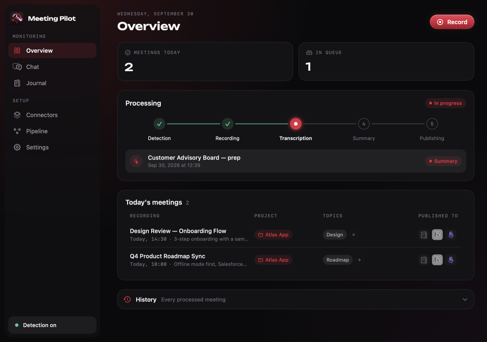
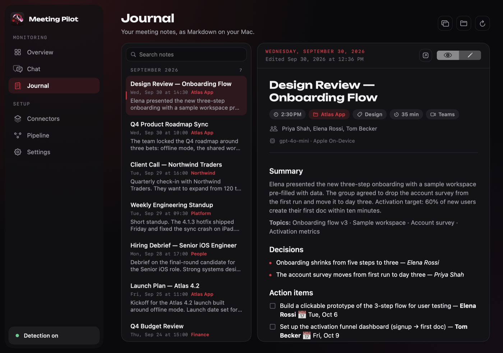
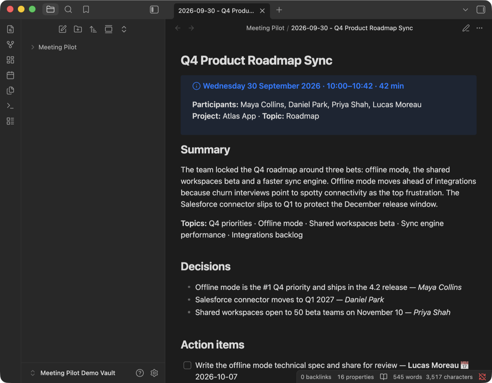
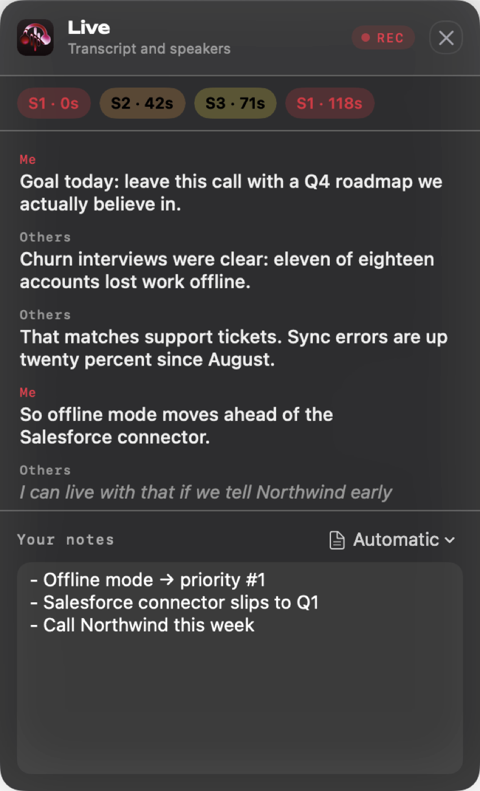
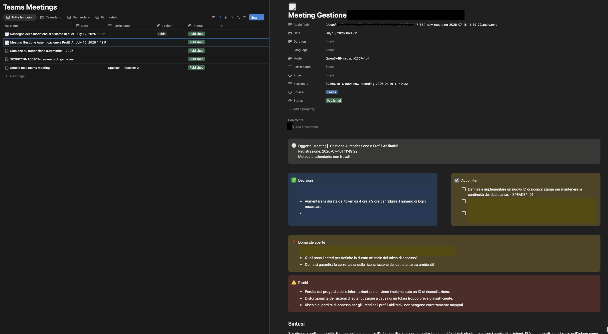
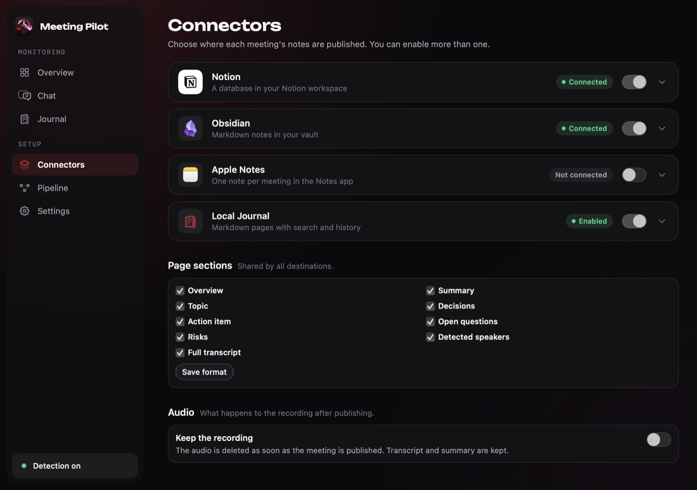
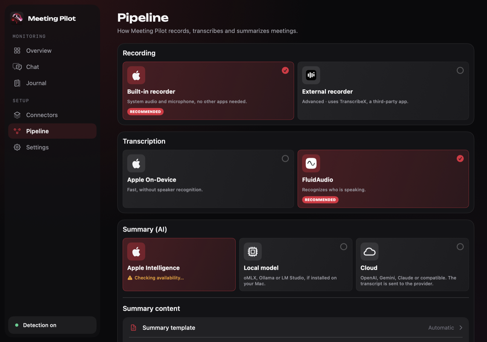

# Meeting Pilot

**Local-first meeting notes for macOS.** When a Teams call starts, Meeting Pilot offers to record it, shows a live transcript with speakers while you take notes, transcribes on your Mac, summarizes with the model you choose, and publishes the notes to a local Diary, Notion, Obsidian, or Apple Notes. No bot joins the call.

<p align="center">
  
</p>

<p align="center">
  <a href="https://github.com/mard4/meeting-pilot/releases"><b>Download</b></a> ·
  <a href="SETUP.md">Setup guide</a> ·
  <a href="CHANGELOG.md">Changelog</a>
</p>

## How it works

1. **Record.** When a Teams meeting starts, a banner offers to record it. Audio is captured locally by the built-in macOS recorder; nobody joins the call.
2. **Follow along.** A live sidebar shows the running transcript with speaker segments, next to a notes field. Your notes guide the summary.
3. **Publish.** When the call ends, the meeting is transcribed with FluidAudio (with speaker separation) or Apple On-Device, summarized into decisions, action items, open questions and risks, and published with its date, project, topic and participants.

## Features

- **No meeting bot**: audio never leaves the Mac to be recorded or transcribed.
- **Live sidebar** with transcript, speakers and your notes during the call.
- **Structured summaries**: summary, topics, decisions, action items with owners and due dates, open questions, risks.
- **Your choice of model**: Apple Intelligence, oMLX, Ollama, LM Studio, or any OpenAI-compatible API (OpenAI, Gemini, Claude…).
- **Publish anywhere**: local Diary (default), Notion, Obsidian, Apple Notes — one or several at once.
- **Meeting chat**: filter by project, topic, date and source, and get answers that cite the meetings they come from.

## Screenshots

<p align="center">
  
  <br />
  <em>Meeting chat: pick a project and its topics, get an answer that cites every source</em>
</p>

<table>
  <tr>
    <td align="center" width="50%">
      
      <br />
      <em>Overview: today's meetings, processing status and where each one was published</em>
    </td>
    <td align="center" width="50%">
      
      <br />
      <em>Diary: searchable Markdown notes on your Mac</em>
    </td>
  </tr>
  <tr>
    <td align="center" width="50%">
      
      <br />
      <em>Obsidian: the same meeting as Markdown with front matter</em>
    </td>
    <td align="center" width="50%">
      
      <br />
      <em>Live sidebar during the call</em>
    </td>
  </tr>
  <tr>
    <td align="center" colspan="2">
      
      <br />
      <em>Notion: one table with date, project, topic, participants and duration as columns</em>
    </td>
  </tr>
</table>

## Install

1. Download the `.dmg` from the [Releases page](https://github.com/mard4/meeting-pilot/releases), open it and drag Meeting Pilot into `Applications` — or install from the terminal:

   ```bash
   curl -fsSL https://raw.githubusercontent.com/mard4/meeting-pilot/main/scripts/install.sh | bash
   ```

2. Open Meeting Pilot. If macOS blocks the first launch, open **System Settings → Privacy & Security**, click **Open Anyway** next to Meeting Pilot and confirm. This is needed only once.
3. Approve the permissions macOS asks for (see [Privacy & Permissions](#privacy--permissions)).

Requires macOS 14 or later. Apple Intelligence summaries need macOS 26 or later; on older Macs the app uses a local or API model instead.

## Configure

Everything is set up inside the app.

<table>
  <tr>
    <td align="center" width="50%">
      
      <br />
      <em><b>Connectors</b>: choose where notes are published and which sections they include</em>
    </td>
    <td align="center" width="50%">
      
      <br />
      <em><b>Pipeline</b>: recorder, transcription engine and summary model</em>
    </td>
  </tr>
</table>

- **Notion**: connect your workspace and pick a parent page. Meeting Pilot reuses a matching table or page if one exists; otherwise it creates one page with one table. The first time a meeting is published it adds the columns it needs (`Date`, `Project`, `Tema`, `Participants`, `Duration`, `Source`, `Status`, `Model`, `Language`, `Session ID`). Existing columns are never renamed or retyped, and no series/occurrence hierarchy is created.
- **Obsidian**: choose your vault; notes go into a `Meeting Pilot` folder named `{date} - {title}.md`.
- **Summary model**: Apple Intelligence (default where available), a local model (oMLX, Ollama, LM Studio), or an OpenAI-compatible API key. Only the API option sends transcript text off the Mac.

## Run from source

For development or headless use, the pipeline is also a Python CLI:

```bash
python3 -m venv .venv311
source .venv311/bin/activate
pip install -e .
cp .env.example .env   # then fill it in
```

```bash
transcribe-to-notion run-once /path/to/audio.m4a            # process one file
transcribe-to-notion run-once /path/to/audio.m4a --dry-run  # without publishing
transcribe-to-notion watch                                  # watch the inbox folder
transcribe-to-notion teams-scrape --output ~/TeamsMeetings/teams-runtime.json
transcribe-to-notion chat --question "What did we decide about offline mode?" \
  --project "Atlas App" --theme Roadmap --theme Launch
```

Meetings move through `~/TeamsMeetings/{inbox_audio,processing,done,failed}`. `teams-scrape` reads the meeting title and participants from the Teams window (Accessibility first, on-device OCR as a fallback); the next processing run uses them.

To start the watcher at login without the app:

```bash
mkdir -p ~/Library/LaunchAgents
cp launchd/com.transcribe-to-notion.watch.plist.example ~/Library/LaunchAgents/com.transcribe-to-notion.watch.plist
launchctl load ~/Library/LaunchAgents/com.transcribe-to-notion.watch.plist
tail -f ~/Library/Logs/transcribe-to-notion.log ~/Library/Logs/transcribe-to-notion.err.log
```

The full step-by-step bootstrap is in [SETUP.md](SETUP.md).

### Main environment variables

The app writes these for you; set them by hand only when running from source. See `.env.example` for the complete list.

| Variable | Purpose |
| --- | --- |
| `PUBLISH_TARGETS` | `journal`, `notion`, `obsidian`, `apple_notes` (comma-separated). Defaults to the local Diary. |
| `JOURNAL_ROOT` | Diary root, default `~/Library/Application Support/Meeting Pilot/Diary` (Markdown by year/month plus a rebuildable `index.sqlite`). |
| `NOTION_TOKEN`, `NOTION_PARENT_PAGE_ID` | Notion integration token and the page Meeting Pilot publishes under. |
| `NOTION_DATABASE_ID`, `NOTION_PAGE_NAME` | The meetings table (found or created by setup) and its page name, default `Meeting Pilot`. |
| `NOTION_PROJECT_PROPERTY`, `NOTION_INCLUDE_*` | Project column name (default `Project`) and which sections each page includes. |
| `OBSIDIAN_VAULT_PATH`, `OBSIDIAN_FOLDER`, `OBSIDIAN_FILENAME_TEMPLATE` | Vault root, folder inside it (default `Meeting Pilot`) and filename template (default `{date} - {title}.md`). |
| `SUMMARY_PROVIDER_MODE` | `apple` (Apple Intelligence), `local` (oMLX/Ollama/LM Studio) or `api`. |
| `SUMMARY_BASE_URL`, `SUMMARY_MODEL`, `SUMMARY_API_KEY` | OpenAI-compatible endpoint, model and key. |
| `SUMMARY_PROMPT` | Optional extra instructions applied to every summary. |
| `TRANSCRIPTION_PROVIDER` | `fluid` (bundled, with speaker separation) or `apple`. |
| `MEETINGS_ROOT`, `INBOX_AUDIO_DIR` | Archive root (default `~/TeamsMeetings`) and the folder the watcher reads recordings from. |
| `RECORDER_MODE`, `RECORDING_PROMPT_ENABLED`, `RECORDING_PROMPT_DELAY_SECONDS` | Recorder mode (`macos_prompt` by default) and the banner shown when a meeting starts. |

## Privacy & Permissions

Meeting Pilot processes meeting audio and Teams/Calendar metadata. Understand what it touches before installing:

- **Audio & transcripts**: recorded locally into `INBOX_AUDIO_DIR` and transcribed on-device (FluidAudio or Apple On-Device). Nothing audio-related is uploaded.
- **Summaries**: generated by the provider you choose. `apple` and `local` run entirely on-device. `api` sends the transcript text to the endpoint in `SUMMARY_BASE_URL` — review that provider's data policy before enabling it.
- **Meeting metadata**: read from the Teams window via Accessibility, or from a screenshot with on-device OCR (Apple Vision) if that fails. Calendar and Outlook lookups, when enabled, read local data to match a meeting's subject and participants.
- **Storage**: meetings and transcripts are archived under `MEETINGS_ROOT` (default `~/TeamsMeetings`) and written to the Diary, Obsidian vault, Apple Notes or Notion workspace you choose.
- **macOS permissions**: Accessibility (read the Teams UI), Screen Recording (OCR fallback), Calendar (meeting metadata) and Automation (Outlook lookup, if configured), each requested only when the feature is used.

If you record meetings other people are in, make sure you have the right to do so under your organization's policy and applicable law.

The permission prompts shown by macOS:


## License

Copyright (C) 2026 Mardeen

Meeting Pilot is free software: you can redistribute it and/or modify it under the terms of the [GNU General Public License v3.0](LICENSE) or (at your option) any later version. It is distributed WITHOUT ANY WARRANTY; see the license for details.

In short: you may use, study, modify and share the code, but any distributed version — modified or not — must stay under the GPL with its source available.

## Trademark

"Meeting Pilot" and the Meeting Pilot logo are not covered by the GPL. Forks and redistributed builds must use a different name and icon, and must not suggest they are the official app. Official signed builds are only published from this repository's Releases page.
