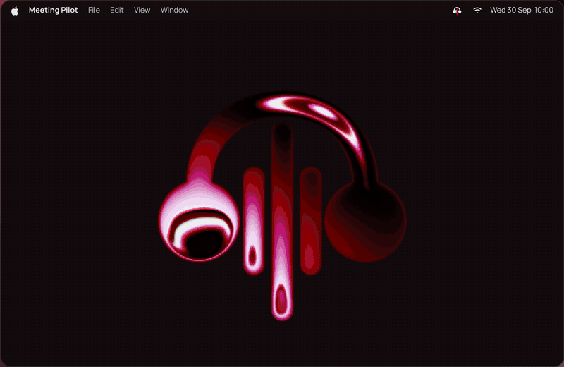
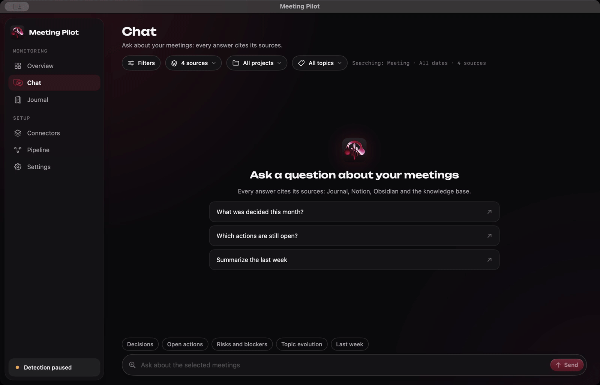
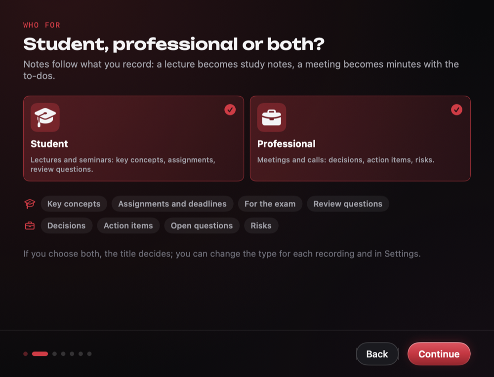
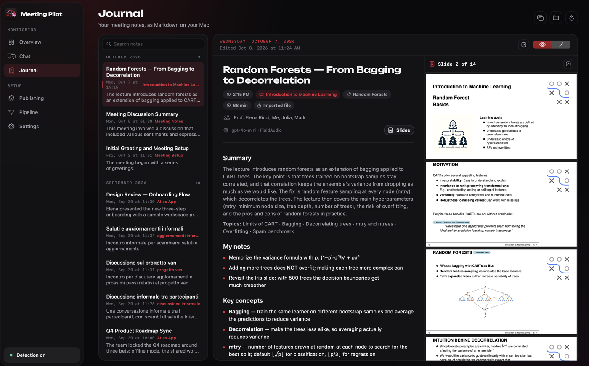
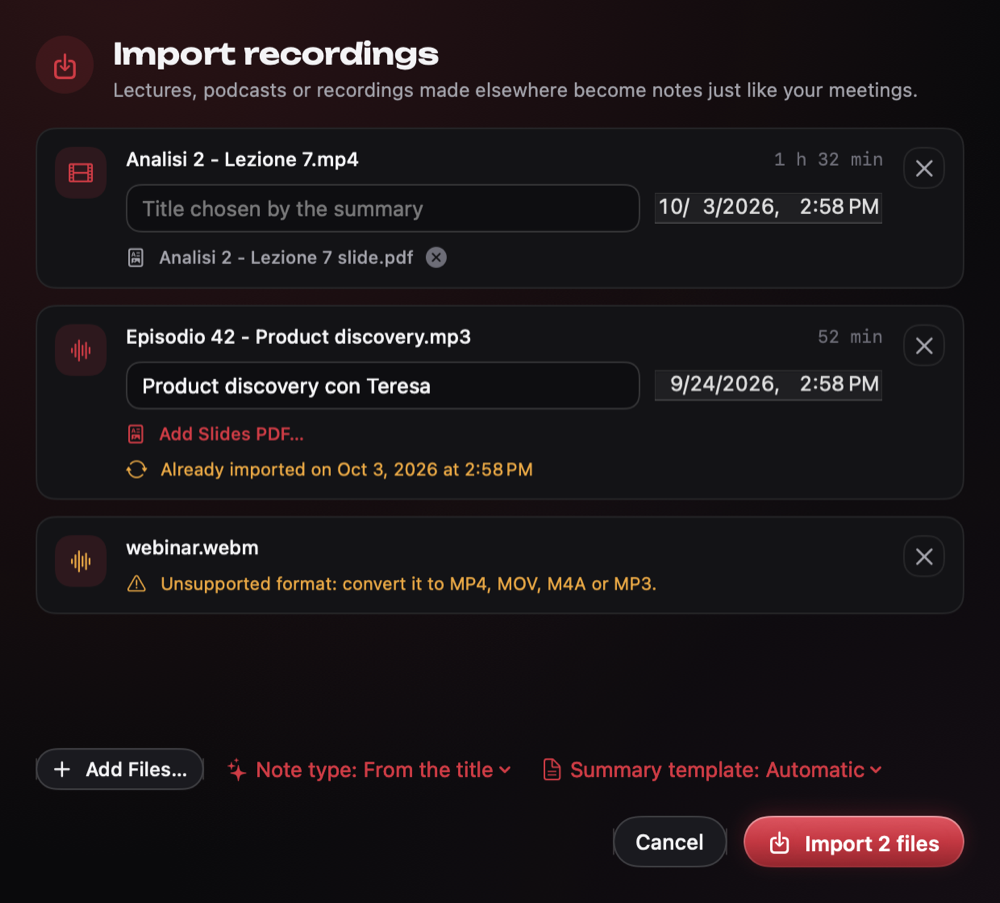
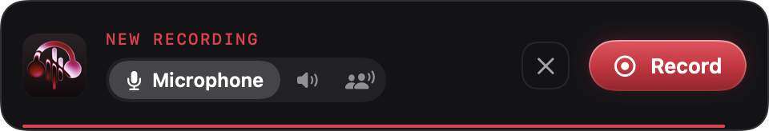
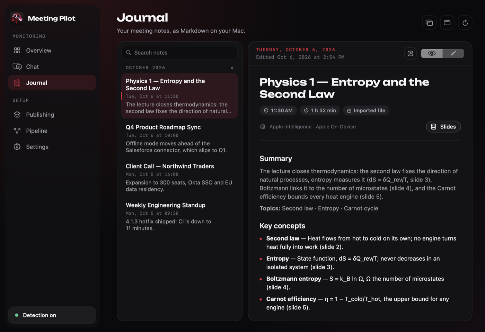
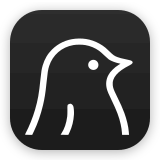
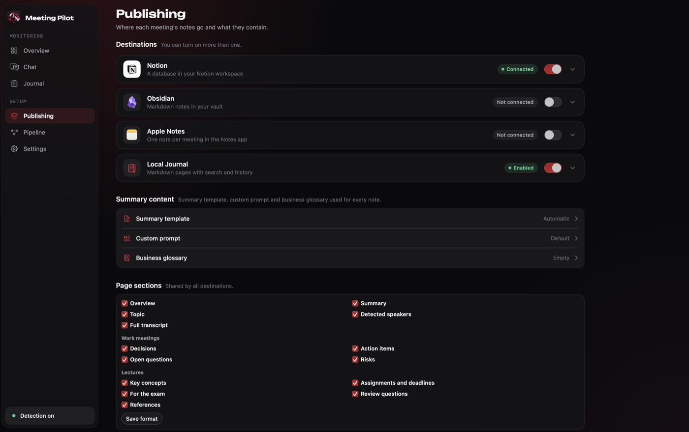
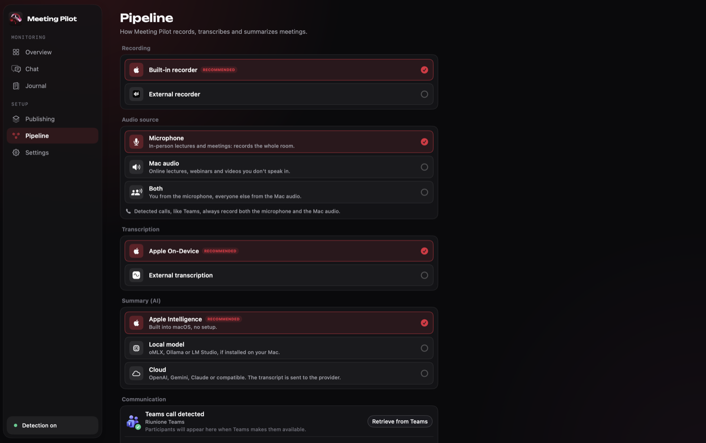

<p align="center">
  <a href="https://meetingpilotapp.com">
    
  </a>
</p>

<h1 align="center">Meeting Pilot</h1>
<p align="center">
  <a href="https://meetingpilotapp.com">🌐 Website</a> ·
  <a href="https://github.com/mard4/meeting-pilot/releases/latest/download/MeetingPilot.dmg">⬇ Download</a> ·
  <a href="mailto:support@meetingpilotapp.com">@ Email</a> ·
  <a href="https://martidan.gumroad.com/l/meetingpilot">♥ Support</a>
</p>

<!-- <h3 align="center">Your meetings. Your data.</h3> -->

<p align="center">
  
</p>

```bash
curl -fsSL https://raw.githubusercontent.com/mard4/meeting-pilot/main/macos/MeetingPilot/Scripts/install.sh | bash
```

<p align="center">
  Local-first meeting and lecture notes for macOS. From call or class to notes to answers.
</p>
<table align="center">
  <tr>
    <td align="center"><br /><sub><b>No bot</b></sub></td>
    <td align="center"><br /><sub><b>Zero cloud</b></sub></td>
    <td align="center"><br /><sub><b>Free</b></sub></td>
    <td align="center"><br /><sub><b>MacOS </b></sub></td>
  </tr>
</table>

<p align="center">
  <a href="https://meetingpilotapp.com/">Website</a> ·
  <a href="docs/SETUP.md">Setup</a> ·
  <a href="docs/CHANGELOG.md">Changelog</a> ·
  <a href="docs/DEVELOPMENT.md">Developers</a>
</p>


---

<h2 align="center">Join the call. That's it.</h2>

<p align="center">Teams calls are detected and recorded on their own. Lectures, in-person meetings and files made elsewhere take one click.</p>

<p align="center"></p>

<table align="center">
  <tr>
    <td align="center" width="16%"><br /><b>Detect</b><br /><sub></sub></td>
    <td align="center" width="16%"><br /><b>Record</b><br /><sub></sub></td>
    <!-- <td align="center" width="16%"><br /><b>Auto-stop</b><br /><sub></sub></td> -->
    <td align="center" width="16%"><br /><b>Transcribe</b><br /><sub></sub></td>
    <td align="center" width="16%"><br /><b>Summarize</b><br /><sub></sub></td>
    <td align="center" width="16%"><br /><b>Publish</b><br /><sub></sub></td>
        <td align="center" width="16%"><br /><b>Ask</b><br /><sub></sub></td>
  </tr>
</table>


---

<table>
  <tr>
    <td width="40%" valign="middle">
      <!-- <sub>LIVE TRANSCRIPT</sub> -->
      <h3>LIVE TRANSCRIPT</h3>
      Live transcript with speakers, next to your notes. Your notes guide the summary.
    </td>
    <td width="60%" align="center"></td>
  </tr>
  <tr>
    <td width="60%" align="center"></td>
    <td width="40%" valign="middle">
      <!-- <sub>MEETING CHAT</sub> -->
      <h3>MEETING CHAT</h3>
      Pick projects and topics, then ask. Every line cites the meeting it came from.
    </td>
  </tr>
  <tr>
    <td width="40%" valign="middle">
      <h3>STUDENT, PROFESSIONAL OR BOTH</h3>
      Lectures become study notes: key concepts, assignments and deadlines, exam hints, review questions. Meetings keep decisions, action items and risks. Doing both? The title decides.
    </td>
    <td width="60%" align="center"></td>
  </tr>
  <tr>
    <td width="60%" align="center"></td>
    <td width="40%" valign="middle">
      <h3>SLIDES NEXT TO THE TRANSCRIPT</h3>
      Add the lecture's PDF: every part of the transcript is matched to its slide, on your Mac and without a model. The summary cites them as <i>(slide 3)</i>. Got the PDF after the lecture? Add it to any recording later: names and terms the transcript misheard are corrected from the slides, and the summary and notes are rewritten.
    </td>
  </tr>
  <tr>
    <td width="40%" valign="middle">
      <h3>IMPORT</h3>
      Lecture videos, podcasts, webinars recorded elsewhere. Drop them on the window or press <kbd>⌘I</kbd>; the original stays where it is.
    </td>
    <td width="60%" align="center"></td>
  </tr>
  <tr>
    <td width="60%" align="center"></td>
    <td width="40%" valign="middle">
      <h3>ANY ROOM</h3>
      Not on a call? Record the microphone for a classroom, the Mac audio for an online lecture, or both.
    </td>
  </tr>
  <tr>
    <td width="40%" valign="middle">
      <!-- <sub>JOURNAL</sub> -->
      <h3>JOURNAL</h3>
      Built-in, searchable, plain Markdown.
    </td>
    <td width="60%" align="center"></td>
  </tr>
</table>

---

<h2 align="center">Works with your stack.</h2>

<table align="center">
  <tr>
    <th align="left">Publish</th>
    <td align="center"><br /><sub>Journal</sub></td>
    <td align="center"><br /><sub>Notion</sub></td>
    <td align="center"><br /><sub>Obsidian</sub></td>
    <td align="center"><br /><sub>Apple Notes</sub></td>
  </tr>
  <tr>
    <th align="left">Summaries<br /><sub>Local or Cloud</sub></th>
    <td align="center"><br /><sub>Apple Intelligence</sub></td>
    <td align="center"><br /><sub>oMLX</sub></td>
    <td align="center"><br /><sub>Ollama</sub></td>
    <td align="center"><br /><sub>LM Studio</sub></td>
  </tr>
  <tr>
    <th align="left"><br /><sub></sub></th>
    <td align="center"><br /><sub>OpenAI</sub></td>
    <td align="center"><br /><sub>Gemini</sub></td>
    <td align="center"><br /><sub>Claude</sub></td>
    <!-- <td align="center"><br /><sub>Any OpenAI-compatible</sub></td> -->
  </tr>
  <tr>
    <th align="left">Capture</th>
    <td align="center"><br /><sub>Apple On-Device</sub></td>
    <td align="center"><br /><sub>Microsoft Teams</sub></td>
    <td align="center"><br /><sub>FluidAudio · speakers</sub></td>
    <td align="center"><br /><sub>Slack · <i>soon</i></sub></td>
  </tr>
</table>

---

## ⬇ Installation

1. **[Download the `.dmg`](https://github.com/mard4/meeting-pilot/releases/latest/download/MeetingPilot.dmg)** → drag to `Applications` (or use the `curl` one-liner above).
2. Blocked on first launch? **System Settings → Privacy & Security → Open Anyway**. Once.
3. A short welcome tour asks whether you study, work or both, then the permissions below, as they're needed.

<sub>macOS 14+. On macOS 26+ Apple transcribes and FluidAudio labels the speakers, and Apple Intelligence can write the summaries. Older Macs download the Parakeet speech model (~460 MB) on first use and summarize with a local or API model.</sub>

<table>
  <tr>
    <td align="center" width="50%"><br /><sub><b>Publishing</b> · where notes go, what they include</sub></td>
    <td align="center" width="50%"><br /><sub><b>Pipeline</b> · recorder, audio source, transcription, summary model</sub></td>
  </tr>
</table>

<details>
<summary><b>Publishing details</b></summary>

- **Notion**: connect your workspace and pick a parent page. Meeting Pilot reuses a matching table or page if one exists; otherwise it creates one page with one table. On first publish it adds the columns it needs (`Date`, `Project`, `Tema`, `Participants`, `Duration`, `Source`, `Status`, `Model`, `Language`, `Session ID`). Once you study, a `Type` column (Work / Study) is added too. Existing columns are never renamed or retyped. Lectures with slides get the PDF and one section per slide.
- **Obsidian**: choose your vault; notes go into a `Meeting Pilot` folder named `{date} - {title}.md`; each part of a lecture links to its slide page.
- **Summary model**: Apple Intelligence (default where available), a local model (oMLX, Ollama, LM Studio), or an OpenAI-compatible API key. Only the API option sends transcript text off the Mac.

</details>

<!-- ---

### 📝 After every meeting

| | |
|---|---|
| ✨ **Summary** & topics | ✅ **Decisions** |
| 📌 **Action items** with owners & due dates | ❓ **Open questions** & ⚠️ **risks** |
| 🗣️ Full **transcript** with speakers | 🏷️ Date, duration, project, topic, participants | -->

---

<!-- <h2 align="center">The difference is where your data goes.</h2>

| | **Meeting Pilot** | Similar products |
|---|---|---|
| 🎙️ Audio processing | ✅ **On-device** | ☁️ Stored in the cloud |
| 🗂️ Where notes live | ✅ **Your Mac or your Notion** | ☁️ The vendor's cloud |
| 🤖 Meeting bot | ✅ **None** | 👀 Often a visible bot |
| ✨ Summarization | ✅ **On-device**, or your own key | ☁️ The vendor's cloud AI |
| 💻 Platform | ✅ **Native macOS** app | 🔑 Requires a cloud account |

<sub>General patterns, not claims about any single product.</sub> -->


## Privacy & Permissions

| | |
|---|---|
| 🎙️ **Audio & transcripts** | Recorded and transcribed on your Mac. Never uploaded. |
| ✨ **Summaries** | Apple Intelligence & local models run on-device. API mode sends transcript text only to the provider you choose. |
| 🏷️ **Meeting metadata** | From the Teams window (Accessibility), on-device OCR as fallback, plus Calendar / Outlook if enabled. |
| 💾 **Storage** | Archived in `~/TeamsMeetings`; published only to destinations you pick. Imported files stay where they are. |
| 🔗 **Notion connect** | One-click OAuth goes through a stateless [Cloudflare Worker](docs/cloudflare/meeting-pilot-oauth.js) that never sees your meetings. Or paste your own token. |

**macOS permissions** — asked only when a feature needs them:

| ♿ Accessibility | 🖥️ Screen Recording | 📅 Calendar | ⚙️ Automation |
|:---:|:---:|:---:|:---:|
| <sub>Title & participants from Teams</sub> | <sub>On-device OCR fallback</sub> | <sub>Meeting details</sub> | <sub>Outlook lookup, if enabled</sub> |

<details>
<summary>See the macOS prompts</summary>
<br />


</details>

> [!IMPORTANT]
> Make sure you're allowed to record the people in your meetings.

## 🛠️ For developers

Run from source, headless CLI, environment config → [DEVELOPMENT.md](docs/DEVELOPMENT.md). Contributing → [CONTRIBUTING.md](.github/CONTRIBUTING.md).

## ♥ Support

Meeting Pilot is free and will stay free. If it saves you time, you can [pay what you want on Gumroad](https://martidan.gumroad.com/l/meetingpilot): it helps cover the Apple Developer account that signs the app and keeps updates coming. Enter €0 and you get exactly the same app.

## License

Copyright (c) 2026 Mardeen · [MIT](LICENSE). Use, study, modify and share, including commercially, as long as the copyright notice is kept.

**Trademark:** "Meeting Pilot" and its logo are not covered by the MIT license ([TRADEMARKS.md](TRADEMARKS.md)). Forks must use a different name and icon. Official signed builds come only from this repo's [Releases](https://github.com/mard4/meeting-pilot/releases).

<p align="center">
  <a href="https://github.com/mard4/meeting-pilot/releases/latest"></a>
  
  <a href="LICENSE"></a>
  <a href="https://meetingpilot.pages.dev/"></a>
<a href="https://martidan.gumroad.com/l/meetingpilot"></a>
<a href="mailto:support@meetingpilotapp.com"></a>
</p>


<p align="center"><br /><br /><sub>Your meetings. Your data.</sub></p>
