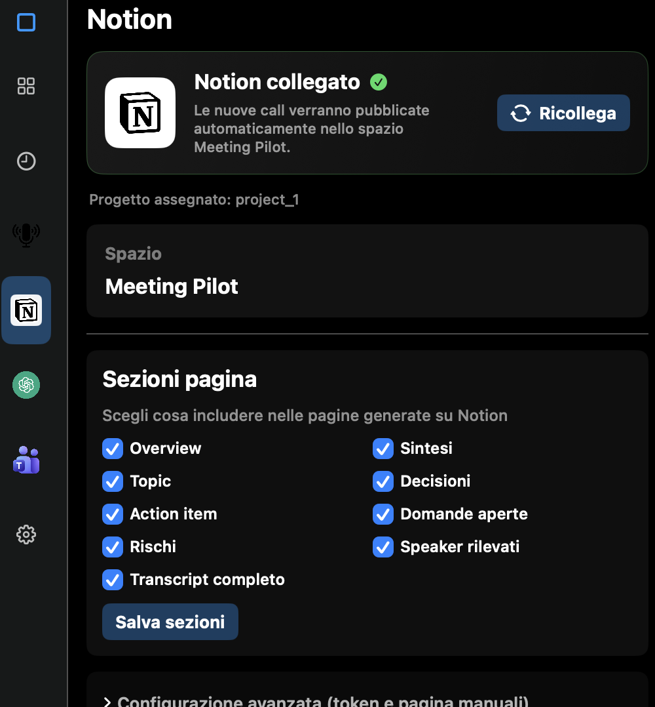
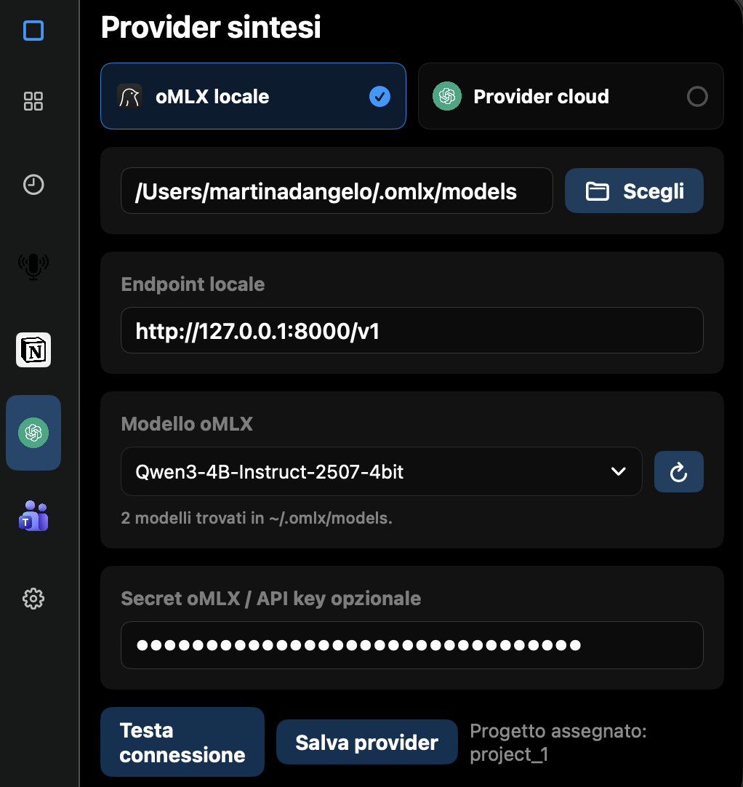

# Meeting Pilot

Automatic pipeline for capturing Teams meetings on macOS, processing them locally with FluidAudio or Apple On-Device, generating a summary with an OpenAI-compatible provider, and saving the result to a local Diary, Notion, Obsidian, or Apple Notes.

## Preview

<table>
  <tr>
    <td align="center" width="50%">
      
      <br />
      <em>App preview</em>
    </td>
    <td align="center" width="50%">
      
      <br />
      <em>Notion page preview</em>
    </td>
  </tr>
</table>


## Quick Start

1. Download the current `.dmg` from the [GitHub Releases page](../../releases).
2. Open the `.dmg`.
3. Drag the app into `Applications`.
4. Open Meeting Pilot from `Applications`. The app is not notarized yet, so macOS blocks the first launch: open **System Settings → Privacy & Security**, scroll down and click **Open Anyway** next to Meeting Pilot, then confirm. This is needed only once.

5. When macOS asks for permissions, approve them if prompted.
6. Open Meeting Pilot and configure Notion inside the app, or set an Obsidian vault path in `.env` if you want local Markdown notes instead.

<p align="center">
  
</p>

7. Open Meeting Pilot and configure the LLM inside the app.

<p align="center">
  
</p>


## Flow

```text
Teams on macOS
  -> macOS recorder saves an audio file into inbox_audio
  -> watcher detects the stable file
  -> FluidAudio or Apple On-Device generates the transcript
  -> OpenAI-compatible provider generates structured JSON summary
  -> local Diary (default), Notion, Obsidian, or Apple Notes receives the generated meeting page
  -> session is archived in done or failed
```

## Local Setup

```bash
python3 -m venv .venv311
source .venv311/bin/activate
pip install -e .
cp .env.example .env
```

Then fill in `.env` and load it into your shell:

```bash
set -a
source .env
set +a
```

## Folders

Default layout:

```text
~/TeamsMeetings/
  inbox_audio/
  processing/
  done/
  failed/
```

Configure TranscribeX or the macOS recorder to save audio automatically to the folder set in `INBOX_AUDIO_DIR` (see `.env.example`).

## Usage

Process a single file:

```bash
transcribe-to-notion run-once /path/to/audio.m4a
```

Start the automatic watcher:

```bash
transcribe-to-notion watch
```

Read the meeting subject and participants from the open Teams window:

```bash
transcribe-to-notion teams-scrape --output ~/TeamsMeetings/teams-runtime.json
```

If you do not pass `--output`, the command writes to the file configured by `TEAMS_RUNTIME_METADATA_FILE`, and the next processing run uses it to populate the Notion page with subject and participants.

Dry-run mode without Notion:

```bash
transcribe-to-notion run-once /path/to/audio.m4a --dry-run
```

## Automatic Startup on macOS

After creating the virtual environment and configuring `.env`, you can install the `launchd` job:

```bash
mkdir -p ~/Library/LaunchAgents
cp launchd/com.transcribe-to-notion.watch.plist.example ~/Library/LaunchAgents/com.transcribe-to-notion.watch.plist
launchctl load ~/Library/LaunchAgents/com.transcribe-to-notion.watch.plist
```

Logs:

```bash
tail -f ~/Library/Logs/transcribe-to-notion.log
tail -f ~/Library/Logs/transcribe-to-notion.err.log
```

## Main Environment Variables

- `NOTION_TOKEN`: Notion integration token.
- `NOTION_PARENT_PAGE_ID`: Notion page selected as the parent destination.
- `NOTION_PAGE_NAME`: Configurable destination name, default `Meeting Pilot`.
- `NOTION_APP_PAGE_ID`: Named child page reused or created by setup.
- `NOTION_DATABASE_ID`: The single table where meeting pages are added.
- `NOTION_OCCURRENCES_DATABASE_ID`: Compatibility alias for `NOTION_DATABASE_ID`.
- `NOTION_SERIES_DATABASE_ID`: Legacy compatibility value; new setup clears it.
- `PUBLISH_TARGETS`: One or more targets: `journal`, `notion`, `obsidian`, or `apple_notes`. With no target configured, the local Diary is used.
- `JOURNAL_ROOT`: Local Diary root, default `~/Library/Application Support/Meeting Pilot/Diary`. It contains portable Markdown pages grouped by year/month and a rebuildable `index.sqlite` for search.
- `OBSIDIAN_VAULT_PATH`: Root folder of your Obsidian vault. If Notion is not configured, Meeting Pilot writes a Markdown note there.
- `OBSIDIAN_FOLDER`: Folder created inside the vault, default `Meeting Pilot`.
- `OBSIDIAN_FILENAME_TEMPLATE`: Filename template for Obsidian notes, default `{date} - {title}.md`.
- `NOTION_PROJECT_PROPERTY`: Select property used to assign each meeting to a project, default `Project`.
- `NOTION_INCLUDE_*`: Enable or disable sections in the generated page.
- `SUMMARY_PROVIDER_MODE`: `apple` for Apple Intelligence on-device, `local` for oMLX, or `api` for an external provider.
- `APPLE_INTELLIGENCE_SUMMARIZER_CMD`: Native helper bundled in the macOS app; normally configured automatically.
- `APPLE_INTELLIGENCE_TIMEOUT_SECONDS`: Maximum duration for an on-device summary, default `1800`.

Notion setup reuses a matching table or a matching named page containing a
table. When neither exists, it creates one named page with one table containing
only the required title column. Meeting Pilot never creates series/occurrence
sections or optional columns; during publication it fills only compatible
columns already present in the selected table.
- `LOCAL_MODELS_DIR`: Local oMLX models folder, default `~/.omlx/models`.
- `SUMMARY_BASE_URL`: OpenAI-compatible endpoint, local or remote.
- `SUMMARY_MODEL`: Model used for the summary.
- `SUMMARY_PROMPT`: Optional custom instructions applied to every meeting summary before publication.
- `SUMMARY_API_KEY`: API key for the provider, if required.
- `SUMMARY_RESPONSE_FORMAT_JSON`: Enable JSON mode if the provider supports it.
- `MEETINGS_ROOT`: Archive root, default `~/TeamsMeetings`.
- `RECORDER_MODE`: Recorder UI mode: `transcribex`, `macos_prompt`, or `custom`.
- `INBOX_AUDIO_DIR`: Folder where the recorder saves audio and where the watcher looks for files.
- `RECORDING_PROMPT_ENABLED`: Enable the macOS banner to start recording.
- `RECORDING_PROMPT_DELAY_SECONDS`: Delay before the banner, default `3`.
- `RECORDER_OPEN_TARGET`: App, folder, or URL opened when you press `Start` in the notification.
- `TRANSCRIPTION_PROVIDER`: `fluid` (included, with speaker separation) or `apple`.
- `FLUID_AUDIO_CMD`: internal FluidAudio command path, managed by the app.
- `TEAMS_RUNTIME_METADATA_FILE`: JSON file produced by `teams-scrape` with data read from the Teams UI.

For the full bootstrap process, see [SETUP.md](SETUP.md).

## macOS Notes

On supported Macs with macOS 26 or later, Apple Intelligence is the default summary provider. The app checks that Apple Intelligence is enabled and that its model is ready. On older or unsupported Macs, the Apple option is disabled and the app falls back to the local oMLX configuration without raising the minimum macOS version of the DMG.

FluidAudio is included with the Parakeet v3 model and speaker diarization. Audio recording remains handled by the macOS recorder that already works with Teams.

The `teams-scrape` command first uses AppleScript and Accessibility to read the Teams UI, and if it cannot extract enough data it falls back to screenshot plus OCR with Apple Vision.

## Privacy & Permissions

Meeting Pilot processes meeting audio and Teams/Calendar metadata. Understand what it touches before installing:

- **Audio & transcripts**: recorded locally by the macOS recorder into `INBOX_AUDIO_DIR`, transcribed on-device (FluidAudio or Apple On-Device). Nothing audio-related is uploaded unless you configure a cloud transcription provider yourself.
- **Summaries**: generated by whatever `SUMMARY_PROVIDER_MODE` you configure. `apple` and `local` (oMLX) run entirely on-device. `api` mode sends the transcript text to the OpenAI-compatible endpoint you configure in `SUMMARY_BASE_URL` — review that provider's own data policy before enabling it.
- **Meeting metadata**: `teams-scrape` reads the Teams window via AppleScript/Accessibility, or falls back to a screenshot + on-device OCR (Apple Vision) if that fails. Calendar and Outlook lookups (when enabled) read local Calendar/Outlook data to match a meeting's subject and participants.
- **Storage**: processed meetings and transcripts are archived locally under `MEETINGS_ROOT` (default `~/TeamsMeetings`) and, depending on `PUBLISH_TARGETS`, written to a local Diary, an Obsidian vault, Apple Notes, or a Notion workspace you control.
- **macOS permissions requested**: Accessibility (read the Teams UI), Screen Recording (OCR fallback), Calendar (meeting metadata), and Automation (Outlook lookup, if configured). The app only requests these when the corresponding feature is used.

If you record meetings other people are in, make sure you have the right to do so under your organization's policy and applicable law.


## License

Copyright (C) 2026 Mardeen

Meeting Pilot is free software: you can redistribute it and/or modify it under the terms of the [GNU General Public License v3.0](LICENSE) or (at your option) any later version. It is distributed WITHOUT ANY WARRANTY; see the license for details.

In short: you may use, study, modify and share the code, but any distributed version — modified or not — must stay under the GPL with its source available.

## Trademark

"Meeting Pilot" and the Meeting Pilot logo are not covered by the GPL. Forks and redistributed builds must use a different name and icon, and must not suggest they are the official app. Official signed builds are only published from this repository's Releases page.
