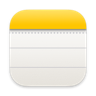
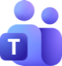

<p align="center">
  
</p>

<h1 align="center">Meeting Pilot</h1>

<h3 align="center">Your meetings. Your data.</h3>

<p align="center">
  Local-first meeting notes for macOS. From call to notes to answers.
</p>

<p align="center">
  <a href="https://github.com/mard4/meeting-pilot/releases/latest"></a>
  
  <a href="LICENSE"></a>
  <a href="https://meetingpilot.pages.dev/"></a>
</p>

<p align="center">
  <a href="https://github.com/mard4/meeting-pilot/releases/latest/download/MeetingPilot.dmg"><b>⬇ Download</b></a> ·
  <a href="https://meetingpilot.pages.dev/">Website</a> ·
  <a href="SETUP.md">Setup</a> ·
  <a href="CHANGELOG.md">Changelog</a> ·
  <a href="DEVELOPMENT.md">Developers</a>
</p>

<table align="center">
  <tr>
    <td align="center"><br /><sub><b>No bot</b></sub></td>
    <td align="center"><br /><sub><b>Zero cloud</b></sub></td>
    <td align="center"><br /><sub><b>Free &amp; open source</b></sub></td>
    <td align="center"><br /><sub><b>Apple Intelligence</b></sub></td>
  </tr>
</table>

<p align="center">
  
</p>

```bash
curl -fsSL https://raw.githubusercontent.com/mard4/meeting-pilot/main/scripts/install.sh | bash
```

---

<h2 align="center">Join the call. That's your only job.</h2>

<p align="center">It notices the call, records it, and writes the notes.</p>

<table align="center">
  <tr>
    <td align="center" width="16%"><br /><b>Detect</b><br /><sub>call starts</sub></td>
    <td align="center" width="16%"><br /><b>Record</b><br /><sub>one click, locally</sub></td>
    <td align="center" width="16%"><br /><b>Auto-stop</b><br /><sub>~15s after the call</sub></td>
    <td align="center" width="16%"><br /><b>Transcribe</b><br /><sub>speakers labelled</sub></td>
    <td align="center" width="16%"><br /><b>Summarize</b><br /><sub>decisions &amp; to-dos</sub></td>
    <td align="center" width="16%"><br /><b>Publish</b><br /><sub>where you want</sub></td>
  </tr>
</table>

<table>
  <tr>
    <td align="center" width="25%" valign="top"><br /><b>Transcribed on your Mac</b><br /><sub>FluidAudio or Apple On-Device</sub></td>
    <td align="center" width="25%" valign="top"><br /><b>Summarized locally</b><br /><sub>Apple Intelligence, oMLX, Ollama, LM Studio</sub></td>
    <td align="center" width="25%" valign="top"><br /><b>Published anywhere</b><br /><sub>Notion, Obsidian, Apple Notes, Journal</sub></td>
    <td align="center" width="25%" valign="top"><br /><b>Chat, on-device</b><br /><sub>Ask across every meeting, every answer sourced</sub></td>
  </tr>
</table>

---

<table>
  <tr>
    <td width="40%" valign="middle">
      <sub>LIVE SIDEBAR</sub>
      <h3>Follow the call as it happens.</h3>
      Live transcript with speakers, next to your notes. Your notes guide the summary.
    </td>
    <td width="60%" align="center"></td>
  </tr>
  <tr>
    <td width="60%" align="center"></td>
    <td width="40%" valign="middle">
      <sub>MEETING CHAT</sub>
      <h3>Ask across every meeting.</h3>
      Pick projects and topics, then ask. Every line cites the meeting it came from.
    </td>
  </tr>
  <tr>
    <td width="40%" valign="middle">
      <sub>JOURNAL</sub>
      <h3>Every meeting, kept on your Mac.</h3>
      Built-in, searchable, plain Markdown.
    </td>
    <td width="60%" align="center"></td>
  </tr>
  <tr>
    <td width="60%" align="center"></td>
    <td width="40%" valign="middle">
      <sub>NO MEETING BOT</sub>
      <h3>It doesn't join your call.</h3>
      Recorded and transcribed on your Mac. No bot, no dial-in.
    </td>
  </tr>
  <tr>
    <td width="40%" valign="middle">
      <sub>NOTION</sub>
      <h3>Reuses your workspace.</h3>
      One table. Date, project, topic, participants and duration as columns.
    </td>
    <td width="60%" align="center"></td>
  </tr>
  <tr>
    <td width="60%" align="center"></td>
    <td width="40%" valign="middle">
      <sub>OBSIDIAN</sub>
      <h3>Plain notes in your vault.</h3>
      Markdown with date, project, topic and participants up top.
    </td>
  </tr>
  <tr>
    <td width="40%" valign="middle">
      <sub>BRING YOUR OWN MODEL</sub>
      <h3>Prefer a cloud model? Your call.</h3>
      OpenAI, Gemini, Claude or any OpenAI-compatible endpoint. Opt-in, and the only time transcript text leaves your Mac.
    </td>
    <td width="60%" align="center"></td>
  </tr>
</table>

### 📝 After every meeting

| | |
|---|---|
| ✨ **Summary** & topics | ✅ **Decisions** |
| 📌 **Action items** with owners & due dates | ❓ **Open questions** & ⚠️ **risks** |
| 🗣️ Full **transcript** with speakers | 🏷️ Date, duration, project, topic, participants |

---

<h2 align="center">The difference is where your data goes.</h2>

| | **Meeting Pilot** | Similar products |
|---|---|---|
| 🎙️ Audio processing | ✅ **On-device** | ☁️ Stored in the cloud |
| 🗂️ Where notes live | ✅ **Your Mac or your Notion** | ☁️ The vendor's cloud |
| 🤖 Meeting bot | ✅ **None** | 👀 Often a visible bot |
| ✨ Summarization | ✅ **On-device**, or your own key | ☁️ The vendor's cloud AI |
| 💻 Platform | ✅ **Native macOS** app | 🔑 Requires a cloud account |

<sub>General patterns, not claims about any single product.</sub>

---

<h2 align="center">Works with your stack.</h2>

<table align="center">
  <tr>
    <th align="left">Publish</th>
    <td align="center"><br /><sub>Notion</sub></td>
    <td align="center"><br /><sub>Obsidian</sub></td>
    <td align="center"><br /><sub>Apple Notes</sub></td>
    <td align="center"><br /><sub>Journal</sub></td>
  </tr>
  <tr>
    <th align="left">Summaries<br /><sub>on your Mac</sub></th>
    <td align="center"><br /><sub>Apple Intelligence</sub></td>
    <td align="center"><br /><sub>oMLX</sub></td>
    <td align="center"><br /><sub>Ollama</sub></td>
    <td align="center"><br /><sub>LM Studio</sub></td>
  </tr>
  <tr>
    <th align="left">Summaries<br /><sub>cloud, opt-in</sub></th>
    <td align="center"><br /><sub>OpenAI</sub></td>
    <td align="center"><br /><sub>Gemini</sub></td>
    <td align="center"><br /><sub>Claude</sub></td>
    <td align="center"><br /><sub>Any OpenAI-compatible</sub></td>
  </tr>
  <tr>
    <th align="left">Capture</th>
    <td align="center"><br /><sub>Microsoft Teams</sub></td>
    <td align="center"><br /><sub>FluidAudio</sub></td>
    <td align="center"><br /><sub>Apple On-Device</sub></td>
    <td align="center"><br /><sub>Slack · <i>soon</i></sub></td>
  </tr>
</table>

---

## 🚀 Install

1. **[Download the `.dmg`](https://github.com/mard4/meeting-pilot/releases/latest/download/MeetingPilot.dmg)** → drag to `Applications` (or use the `curl` one-liner above).
2. Blocked on first launch? **System Settings → Privacy & Security → Open Anyway**. Once.
3. Approve the permissions below, as they're asked.

<sub>macOS 14+. Apple Intelligence summaries need macOS 26+; older Macs use a local or API model.</sub>

<table>
  <tr>
    <td align="center" width="50%"><br /><sub><b>Connectors</b> · where notes go, which sections they include</sub></td>
    <td align="center" width="50%"><br /><sub><b>Pipeline</b> · recorder, transcription, summary model</sub></td>
  </tr>
</table>

<details>
<summary><b>Connector details</b></summary>

- **Notion**: connect your workspace and pick a parent page. Meeting Pilot reuses a matching table or page if one exists; otherwise it creates one page with one table. On first publish it adds the columns it needs (`Date`, `Project`, `Tema`, `Participants`, `Duration`, `Source`, `Status`, `Model`, `Language`, `Session ID`). Existing columns are never renamed or retyped.
- **Obsidian**: choose your vault; notes go into a `Meeting Pilot` folder named `{date} - {title}.md`.
- **Summary model**: Apple Intelligence (default where available), a local model (oMLX, Ollama, LM Studio), or an OpenAI-compatible API key. Only the API option sends transcript text off the Mac.

</details>

## Privacy & Permissions

| | |
|---|---|
| 🎙️ **Audio & transcripts** | Recorded and transcribed on your Mac. Never uploaded. |
| ✨ **Summaries** | Apple Intelligence & local models run on-device. API mode sends transcript text only to the provider you choose. |
| 🏷️ **Meeting metadata** | From the Teams window (Accessibility), on-device OCR as fallback, plus Calendar / Outlook if enabled. |
| 💾 **Storage** | Archived in `~/TeamsMeetings`; published only to destinations you pick. |
| 🔗 **Notion connect** | One-click OAuth goes through a stateless [Cloudflare Worker](cloudflare/meeting-pilot-oauth.js) that never sees your meetings. Or paste your own token. |

**macOS permissions** — asked only when a feature needs them:

| ♿ Accessibility | 🖥️ Screen Recording | 📅 Calendar | ⚙️ Automation |
|:---:|:---:|:---:|:---:|
| <sub>Title & participants from Teams</sub> | <sub>On-device OCR fallback</sub> | <sub>Meeting details</sub> | <sub>Outlook lookup, if enabled</sub> |

<details>
<summary>See the macOS prompts</summary>
<br />


</details>

> [!IMPORTANT]
> Make sure you're allowed to record the people in your meetings.

## 🛠️ For developers

Run from source, headless CLI, environment config → [DEVELOPMENT.md](DEVELOPMENT.md). Contributing → [CONTRIBUTING.md](CONTRIBUTING.md).

## License

Copyright (C) 2026 Mardeen · [GPL-3.0-or-later](LICENSE). Use, study, modify and share; distributed versions must stay GPL with source available.

**Trademark:** "Meeting Pilot" and its logo are not covered by the GPL. Forks must use a different name and icon. Official signed builds come only from this repo's [Releases](https://github.com/mard4/meeting-pilot/releases).

<p align="center"><br /><br /><sub>Your meetings. Your data.</sub></p>
